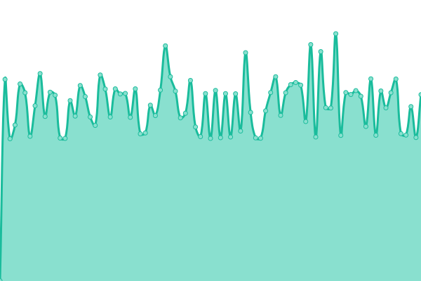
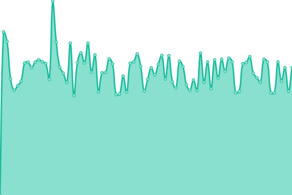

# [📈 Live Status](https://m-akbarfauzi.github.io/test-upptime): <!--live status--> **🟧 Partial outage**

This repository contains the open-source uptime monitor and status page for [Muhammad Akbar Fauzi](https://m-akbarfauzi.github.io/test-upptime), powered by [Upptime](https://github.com/upptime/upptime).

With [Upptime](https://upptime.js.org), you can get your own unlimited and free uptime monitor and status page, powered entirely by a GitHub repository. We use [Issues](https://github.com/m-akbarfauzi/test-upptime/issues) as incident reports, [Actions](https://github.com/m-akbarfauzi/test-upptime/actions) as uptime monitors, and [Pages](https://m-akbarfauzi.github.io/test-upptime) for the status page.

<!--start: status pages-->
<!-- This summary is generated by Upptime (https://github.com/upptime/upptime) -->
<!-- Do not edit this manually, your changes will be overwritten -->
<!-- prettier-ignore -->
| URL | Status | History | Response Time | Uptime |
| --- | ------ | ------- | ------------- | ------ |
|  [Tasikmalaya Kota](https://tasikmalayakota.go.id.com) | 🟥 Down | [tasikmalaya-kota.yml](https://github.com/m-akbarfauzi/uptime/commits/HEAD/history/tasikmalaya-kota.yml) | 

 0ms
     
 | 

<a href="https://check.tasikmalayakota.go.id/history/tasikmalaya-kota">0.09%</a>
    

|  [Portal](https://portal.tasikmalayakota.go.id) | 🟩 Up | [portal.yml](https://github.com/m-akbarfauzi/uptime/commits/HEAD/history/portal.yml) | 

 1729ms
     
 | 

<a href="https://check.tasikmalayakota.go.id/history/portal">50.84%</a>
    

|  [Diskominfo](https://diskominfo.tasikmalayakota.go.id) | 🟩 Up | [diskominfo.yml](https://github.com/m-akbarfauzi/uptime/commits/HEAD/history/diskominfo.yml) | 

 4502ms
     
 | 

<a href="https://check.tasikmalayakota.go.id/history/diskominfo">51.29%</a>
    

|  [SmartKelurahan](https://smartkelurahan.tasikmalayakota.go.id) | 🟥 Down | [smart-kelurahan.yml](https://github.com/m-akbarfauzi/uptime/commits/HEAD/history/smart-kelurahan.yml) | 

 0ms
     
 | 

<a href="https://check.tasikmalayakota.go.id/history/smart-kelurahan">91.41%</a>
    

<!--end: status pages-->

[**Visit our status website →**](https://m-akbarfauzi.github.io/test-upptime)

## 📄 License

- Powered by: [Upptime](https://github.com/upptime/upptime)
- Code: [MIT](./LICENSE) © [Muhammad Akbar Fauzi](https://m-akbarfauzi.github.io/test-upptime)
- Data in the `./history` directory: [Open Database License](https://opendatacommons.org/licenses/odbl/1-0/)
