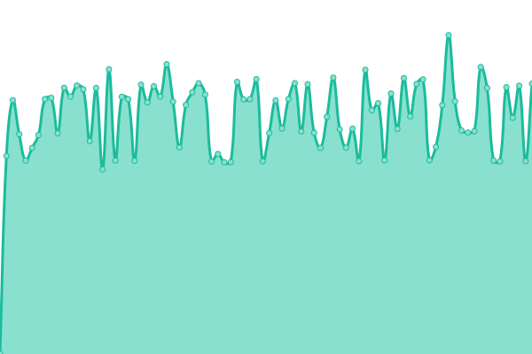
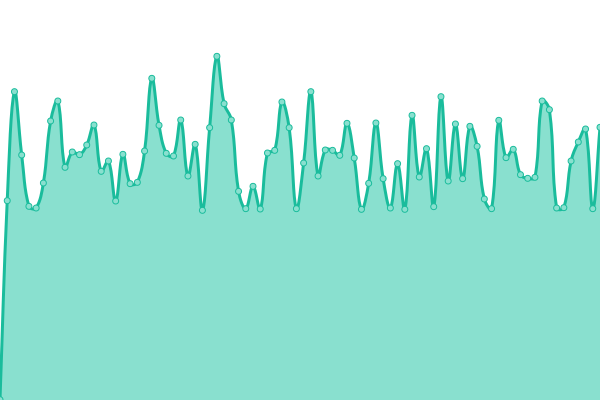
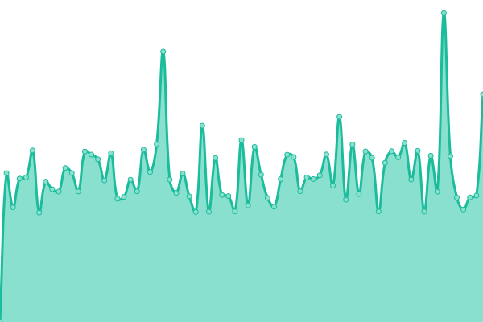
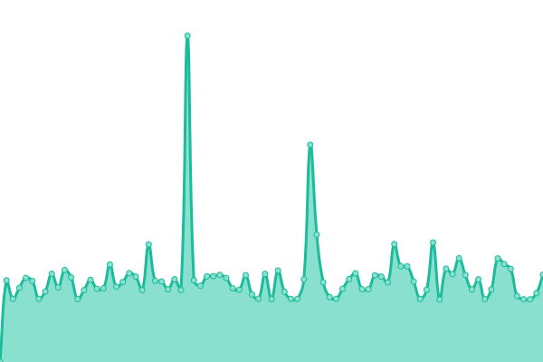
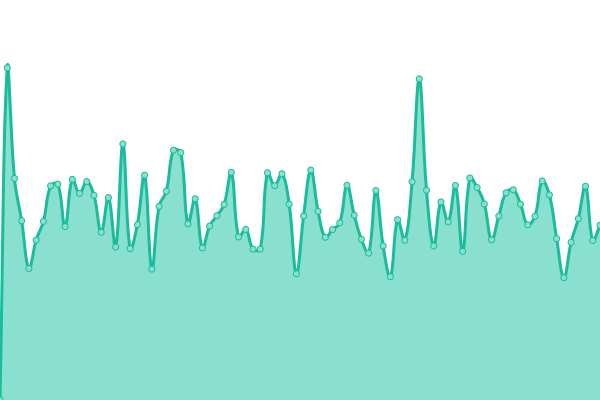

# [📈 Live Status](https://m-akbarfauzi.github.io/test-upptime): <!--live status--> **🟩 All systems operational**

This repository contains the open-source uptime monitor and status page for [Muhammad Akbar Fauzi](https://m-akbarfauzi.github.io/test-upptime), powered by [Upptime](https://github.com/upptime/upptime).

With [Upptime](https://upptime.js.org), you can get your own unlimited and free uptime monitor and status page, powered entirely by a GitHub repository. We use [Issues](https://github.com/m-akbarfauzi/test-upptime/issues) as incident reports, [Actions](https://github.com/m-akbarfauzi/test-upptime/actions) as uptime monitors, and [Pages](https://m-akbarfauzi.github.io/test-upptime) for the status page.

<!--start: status pages-->
<!-- This summary is generated by Upptime (https://github.com/upptime/upptime) -->
<!-- Do not edit this manually, your changes will be overwritten -->
<!-- prettier-ignore -->
| URL | Status | History | Response Time | Uptime |
| --- | ------ | ------- | ------------- | ------ |
|  [Tasikmalaya Kota](https://tasikmalayakota.go.id) | 🟩 Up | [tasikmalaya-kota.yml](https://github.com/m-akbarfauzi/uptime/commits/HEAD/history/tasikmalaya-kota.yml) | 

 1047ms
     
 | 

<a href="https://check.tasikmalayakota.go.id/history/tasikmalaya-kota">60.38%</a>
    

|  [Portal](https://portal.tasikmalayakota.go.id) | 🟩 Up | [portal.yml](https://github.com/m-akbarfauzi/uptime/commits/HEAD/history/portal.yml) | 

 1655ms
     
 | 

<a href="https://check.tasikmalayakota.go.id/history/portal">80.91%</a>
    

|  [Diskominfo](https://diskominfo.tasikmalayakota.go.id) | 🟩 Up | [diskominfo.yml](https://github.com/m-akbarfauzi/uptime/commits/HEAD/history/diskominfo.yml) | 

 4533ms
     
 | 

<a href="https://check.tasikmalayakota.go.id/history/diskominfo">81.15%</a>
    

|  [SmartKelurahan](https://beta.tasikmalayakota.go.id) | 🟩 Up | [smart-kelurahan.yml](https://github.com/m-akbarfauzi/uptime/commits/HEAD/history/smart-kelurahan.yml) | 

 1550ms
     
 | 

<a href="https://check.tasikmalayakota.go.id/history/smart-kelurahan">0.39%</a>
    

|  [Andimas](http://andimas.tasikmalayakota.go.id) | 🟩 Up | [andimas.yml](https://github.com/m-akbarfauzi/uptime/commits/HEAD/history/andimas.yml) | 

 1140ms
     
 | 

<a href="https://check.tasikmalayakota.go.id/history/andimas">100.00%</a>
    

|  [Arsip Dinamis](http://arsipdinamis.tasikmalayakota.go.id) | 🟩 Up | [arsip-dinamis.yml](https://github.com/m-akbarfauzi/uptime/commits/HEAD/history/arsip-dinamis.yml) | 

 789ms
     
 | 

<a href="https://check.tasikmalayakota.go.id/history/arsip-dinamis">100.00%</a>
    

|  [ATCS](http://atcs.tasikmalayakota.go.id) | 🟩 Up | [atcs.yml](https://github.com/m-akbarfauzi/uptime/commits/HEAD/history/atcs.yml) | 

 2075ms
     
 | 

<a href="https://check.tasikmalayakota.go.id/history/atcs">100.00%</a>
    

|  [Ayo Belajar](http://ayobelajar.tasikmalayakota.go.id) | 🟩 Up | [ayo-belajar.yml](https://github.com/m-akbarfauzi/uptime/commits/HEAD/history/ayo-belajar.yml) | 

 2047ms
     
 | 

<a href="https://check.tasikmalayakota.go.id/history/ayo-belajar">100.00%</a>
    

|  [Website Profile Bappelitbangda](http://bappelitbangda.tasikmalayakota.go.id) | 🟩 Up | [website-profile-bappelitbangda.yml](https://github.com/m-akbarfauzi/uptime/commits/HEAD/history/website-profile-bappelitbangda.yml) | 

 5128ms
     
 | 

<a href="https://check.tasikmalayakota.go.id/history/website-profile-bappelitbangda">100.00%</a>
    

|  [Bisma](http://bisma.tasikmalayakota.go.id) | 🟩 Up | [bisma.yml](https://github.com/m-akbarfauzi/uptime/commits/HEAD/history/bisma.yml) | 

 1006ms
     
 | 

<a href="https://check.tasikmalayakota.go.id/history/bisma">100.00%</a>
    

|  [Website Profile BKPSDM](http://bkppd.tasikmalayakota.go.id) | 🟩 Up | [website-profile-bkpsdm.yml](https://github.com/m-akbarfauzi/uptime/commits/HEAD/history/website-profile-bkpsdm.yml) | 

 1152ms
     
 | 

<a href="https://check.tasikmalayakota.go.id/history/website-profile-bkpsdm">100.00%</a>
    

|  [Website Profile BPBD](http://bpbd.tasikmalayakota.go.id) | 🟩 Up | [website-profile-bpbd.yml](https://github.com/m-akbarfauzi/uptime/commits/HEAD/history/website-profile-bpbd.yml) | 

 4418ms
     
 | 

<a href="https://check.tasikmalayakota.go.id/history/website-profile-bpbd">100.00%</a>
    

|  [Website Profile BPKAD](http://bpkad.tasikmalayakota.go.id) | 🟩 Up | [website-profile-bpkad.yml](https://github.com/m-akbarfauzi/uptime/commits/HEAD/history/website-profile-bpkad.yml) | 

 2026ms
     
 | 

<a href="https://check.tasikmalayakota.go.id/history/website-profile-bpkad">100.00%</a>
    

|  [Website Profile Bapenda](http://bpprd.tasikmalayakota.go.id) | 🟩 Up | [website-profile-bapenda.yml](https://github.com/m-akbarfauzi/uptime/commits/HEAD/history/website-profile-bapenda.yml) | 

 1046ms
     
 | 

<a href="https://check.tasikmalayakota.go.id/history/website-profile-bapenda">100.00%</a>
    

|  [Suresman](https://suresman.tasikmalayakota.go.id) | 🟩 Up | [suresman.yml](https://github.com/m-akbarfauzi/uptime/commits/HEAD/history/suresman.yml) | 

 1324ms
     
 | 

<a href="https://check.tasikmalayakota.go.id/history/suresman">100.00%</a>
    

<!--end: status pages-->

[**Visit our status website →**](https://m-akbarfauzi.github.io/test-upptime)

## 📄 License

- Powered by: [Upptime](https://github.com/upptime/upptime)
- Code: [MIT](./LICENSE) © [Muhammad Akbar Fauzi](https://m-akbarfauzi.github.io/test-upptime)
- Data in the `./history` directory: [Open Database License](https://opendatacommons.org/licenses/odbl/1-0/)
