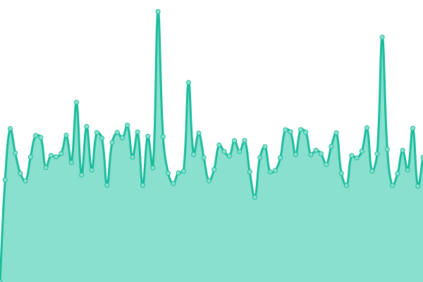
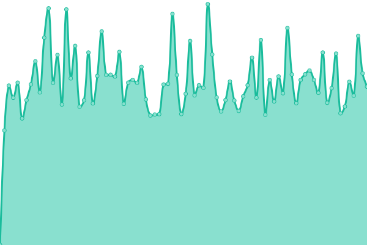
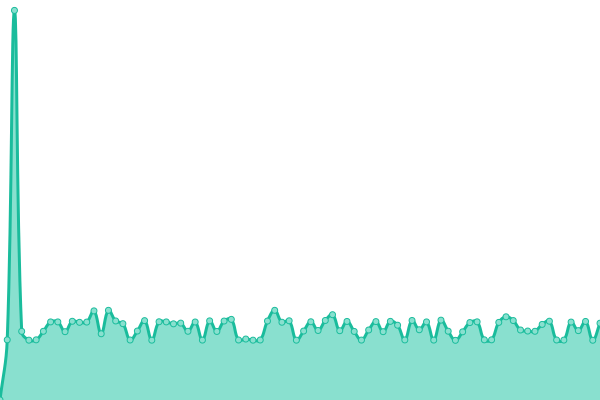

# [📈 Live Status](https://m-akbarfauzi.github.io/test-upptime): <!--live status--> **🟧 Partial outage**

This repository contains the open-source uptime monitor and status page for [Muhammad Akbar Fauzi](https://m-akbarfauzi.github.io/test-upptime), powered by [Upptime](https://github.com/upptime/upptime).

With [Upptime](https://upptime.js.org), you can get your own unlimited and free uptime monitor and status page, powered entirely by a GitHub repository. We use [Issues](https://github.com/m-akbarfauzi/test-upptime/issues) as incident reports, [Actions](https://github.com/m-akbarfauzi/test-upptime/actions) as uptime monitors, and [Pages](https://m-akbarfauzi.github.io/test-upptime) for the status page.

<!--start: status pages-->
<!-- This summary is generated by Upptime (https://github.com/upptime/upptime) -->
<!-- Do not edit this manually, your changes will be overwritten -->
<!-- prettier-ignore -->
| URL | Status | History | Response Time | Uptime |
| --- | ------ | ------- | ------------- | ------ |
|  [Tasikmalaya Kota](https://tasikmalayakota.go.id) | 🟥 Down | [tasikmalaya-kota.yml](https://github.com/m-akbarfauzi/uptime/commits/HEAD/history/tasikmalaya-kota.yml) | 

 988ms
     
 | 

<a href="https://check.tasikmalayakota.go.id/history/tasikmalaya-kota">56.71%</a>
    

|  [Portal](https://portal.tasikmalayakota.go.id) | 🟥 Down | [portal.yml](https://github.com/m-akbarfauzi/uptime/commits/HEAD/history/portal.yml) | 

 1586ms
     
 | 

<a href="https://check.tasikmalayakota.go.id/history/portal">57.12%</a>
    

|  [Email](http://email.tasikmalayakota.go.id) | 🟥 Down | [email.yml](https://github.com/m-akbarfauzi/uptime/commits/HEAD/history/email.yml) | 

 2105ms
     
 | 

<a href="https://check.tasikmalayakota.go.id/history/email">57.82%</a>
    

|  [Suresman](https://suresman.tasikmalayakota.go.id) | 🟥 Down | [suresman.yml](https://github.com/m-akbarfauzi/uptime/commits/HEAD/history/suresman.yml) | 

 1163ms
     
 | 

<a href="https://check.tasikmalayakota.go.id/history/suresman">58.23%</a>
    

|  [Sipentas v.2 (Perizinan Online)](http://new.sipentas.tasikmalayakota.go.id) | 🟥 Down | [sipentas-v-2-perizinan-online.yml](https://github.com/m-akbarfauzi/uptime/commits/HEAD/history/sipentas-v-2-perizinan-online.yml) | 

 1248ms
     
 | 

<a href="https://check.tasikmalayakota.go.id/history/sipentas-v-2-perizinan-online">60.51%</a>
    

|  [Dinas Komunikasi dan Informatika](https://diskominfo.tasikmalayakota.go.id) | 🟥 Down | [dinas-komunikasi-dan-informatika.yml](https://github.com/m-akbarfauzi/uptime/commits/HEAD/history/dinas-komunikasi-dan-informatika.yml) | 

 3652ms
     
 | 

<a href="https://check.tasikmalayakota.go.id/history/dinas-komunikasi-dan-informatika">59.29%</a>
    

|  [Beta](https://beta.tasikmalayakota.go.id) | 🟥 Down | [beta.yml](https://github.com/m-akbarfauzi/uptime/commits/HEAD/history/beta.yml) | 

 1314ms
     
 | 

<a href="https://check.tasikmalayakota.go.id/history/beta">59.69%</a>
    

|  [Andimas](http://andimas.tasikmalayakota.go.id) | 🟥 Down | [andimas.yml](https://github.com/m-akbarfauzi/uptime/commits/HEAD/history/andimas.yml) | 

 1023ms
     
 | 

<a href="https://check.tasikmalayakota.go.id/history/andimas">60.23%</a>
    

|  [Arsip Dinamis](http://arsipdinamis.tasikmalayakota.go.id) | 🟥 Down | [arsip-dinamis.yml](https://github.com/m-akbarfauzi/uptime/commits/HEAD/history/arsip-dinamis.yml) | 

 759ms
     
 | 

<a href="https://check.tasikmalayakota.go.id/history/arsip-dinamis">60.77%</a>
    

|  [ATCS](http://atcs.tasikmalayakota.go.id) | 🟥 Down | [atcs.yml](https://github.com/m-akbarfauzi/uptime/commits/HEAD/history/atcs.yml) | 

 1964ms
     
 | 

<a href="https://check.tasikmalayakota.go.id/history/atcs">61.86%</a>
    

|  [Ayo Belajar](http://ayobelajar.tasikmalayakota.go.id) | 🟥 Down | [ayo-belajar.yml](https://github.com/m-akbarfauzi/uptime/commits/HEAD/history/ayo-belajar.yml) | 

 2159ms
     
 | 

<a href="https://check.tasikmalayakota.go.id/history/ayo-belajar">62.21%</a>
    

|  [Bappelitbangda](http://bappelitbangda.tasikmalayakota.go.id) | 🟥 Down | [bappelitbangda.yml](https://github.com/m-akbarfauzi/uptime/commits/HEAD/history/bappelitbangda.yml) | 

 4667ms
     
 | 

<a href="https://check.tasikmalayakota.go.id/history/bappelitbangda">62.82%</a>
    

|  [Bisma](http://bisma.tasikmalayakota.go.id) | 🟩 Up | [bisma.yml](https://github.com/m-akbarfauzi/uptime/commits/HEAD/history/bisma.yml) | 

 942ms
     
 | 

<a href="https://check.tasikmalayakota.go.id/history/bisma">100.00%</a>
    

|  [BKPSDM](http://bkppd.tasikmalayakota.go.id) | 🟥 Down | [bkpsdm.yml](https://github.com/m-akbarfauzi/uptime/commits/HEAD/history/bkpsdm.yml) | 

 1346ms
     
 | 

<a href="https://check.tasikmalayakota.go.id/history/bkpsdm">63.32%</a>
    

|  [BPBD](http://bpbd.tasikmalayakota.go.id) | 🟥 Down | [bpbd.yml](https://github.com/m-akbarfauzi/uptime/commits/HEAD/history/bpbd.yml) | 

 2725ms
     
 | 

<a href="https://check.tasikmalayakota.go.id/history/bpbd">63.95%</a>
    

|  [BPKAD](http://bpkad.tasikmalayakota.go.id) | 🟥 Down | [bpkad.yml](https://github.com/m-akbarfauzi/uptime/commits/HEAD/history/bpkad.yml) | 

 1054ms
     
 | 

<a href="https://check.tasikmalayakota.go.id/history/bpkad">64.57%</a>
    

|  [Bapenda](http://bpprd.tasikmalayakota.go.id) | 🟥 Down | [bapenda.yml](https://github.com/m-akbarfauzi/uptime/commits/HEAD/history/bapenda.yml) | 

 907ms
     
 | 

<a href="https://check.tasikmalayakota.go.id/history/bapenda">65.20%</a>
    

|  [Command Center](https://cc.tasikmalayakota.go.id/login) | 🟥 Down | [command-center.yml](https://github.com/m-akbarfauzi/uptime/commits/HEAD/history/command-center.yml) | 

 0ms
     
 | 

<a href="https://check.tasikmalayakota.go.id/history/command-center">100.00%</a>
    

|  [CSR](http://csr.tasikmalayakota.go.id) | 🟥 Down | [csr.yml](https://github.com/m-akbarfauzi/uptime/commits/HEAD/history/csr.yml) | 

 1474ms
     
 | 

<a href="https://check.tasikmalayakota.go.id/history/csr">65.56%</a>
    

|  [Dekranasda](http://dekranasda.tasikmalayakota.go.id) | 🟥 Down | [dekranasda.yml](https://github.com/m-akbarfauzi/uptime/commits/HEAD/history/dekranasda.yml) | 

 989ms
     
 | 

<a href="https://check.tasikmalayakota.go.id/history/dekranasda">65.78%</a>
    

|  [Disdukcapil](http://dinasdukcapil.tasikmalayakota.go.id) | 🟥 Down | [disdukcapil.yml](https://github.com/m-akbarfauzi/uptime/commits/HEAD/history/disdukcapil.yml) | 

 2356ms
     
 | 

<a href="https://check.tasikmalayakota.go.id/history/disdukcapil">66.38%</a>
    

|  [Dinas Kesehatan](http://dinkes.tasikmalayakota.go.id) | 🟥 Down | [dinas-kesehatan.yml](https://github.com/m-akbarfauzi/uptime/commits/HEAD/history/dinas-kesehatan.yml) | 

 1008ms
     
 | 

<a href="https://check.tasikmalayakota.go.id/history/dinas-kesehatan">67.09%</a>
    

|  [Dipusipda](http://dipusipda.tasikmalayakota.go.id) | 🟥 Down | [dipusipda.yml](https://github.com/m-akbarfauzi/uptime/commits/HEAD/history/dipusipda.yml) | 

 2028ms
     
 | 

<a href="https://check.tasikmalayakota.go.id/history/dipusipda">68.17%</a>
    

|  [Dinas Pendidikan](http://disdik.tasikmalayakota.go.id) | 🟥 Down | [dinas-pendidikan.yml](https://github.com/m-akbarfauzi/uptime/commits/HEAD/history/dinas-pendidikan.yml) | 

 1640ms
     
 | 

<a href="https://check.tasikmalayakota.go.id/history/dinas-pendidikan">68.35%</a>
    

|  [Dinas Perhubungan](http://dishub.tasikmalayakota.go.id) | 🟥 Down | [dinas-perhubungan.yml](https://github.com/m-akbarfauzi/uptime/commits/HEAD/history/dinas-perhubungan.yml) | 

 1947ms
     
 | 

<a href="https://check.tasikmalayakota.go.id/history/dinas-perhubungan">68.61%</a>
    

|  [Dinas Tenaga Kerja](http://disnaker.tasikmalayakota.go.id) | 🟥 Down | [dinas-tenaga-kerja.yml](https://github.com/m-akbarfauzi/uptime/commits/HEAD/history/dinas-tenaga-kerja.yml) | 

 942ms
     
 | 

<a href="https://check.tasikmalayakota.go.id/history/dinas-tenaga-kerja">68.16%</a>
    

|  [Disperawaskim](http://disperawaskim.tasikmalayakota.go.id) | 🟥 Down | [disperawaskim.yml](https://github.com/m-akbarfauzi/uptime/commits/HEAD/history/disperawaskim.yml) | 

 1190ms
     
 | 

<a href="https://check.tasikmalayakota.go.id/history/disperawaskim">68.57%</a>
    

|  [Disporabudpar](http://disporabudpar.tasikmalayakota.go.id) | 🟥 Down | [disporabudpar.yml](https://github.com/m-akbarfauzi/uptime/commits/HEAD/history/disporabudpar.yml) | 

 4921ms
     
 | 

<a href="https://check.tasikmalayakota.go.id/history/disporabudpar">69.45%</a>
    

|  [Aplikasi Manajemen Surat](http://disposisi.tasikmalayakota.go.id) | 🟥 Down | [aplikasi-manajemen-surat.yml](https://github.com/m-akbarfauzi/uptime/commits/HEAD/history/aplikasi-manajemen-surat.yml) | 

 677ms
     
 | 

<a href="https://check.tasikmalayakota.go.id/history/aplikasi-manajemen-surat">69.85%</a>
    

|  [DPMPTSP](http://dpmptsp.tasikmalayakota.go.id) | 🟥 Down | [dpmptsp.yml](https://github.com/m-akbarfauzi/uptime/commits/HEAD/history/dpmptsp.yml) | 

 761ms
     
 | 

<a href="https://check.tasikmalayakota.go.id/history/dpmptsp">70.39%</a>
    

|  [E-Kinerja](http://ekinerja.tasikmalayakota.go.id) | 🟥 Down | [e-kinerja.yml](https://github.com/m-akbarfauzi/uptime/commits/HEAD/history/e-kinerja.yml) | 

 767ms
     
 | 

<a href="https://check.tasikmalayakota.go.id/history/e-kinerja">70.63%</a>
    

<!--end: status pages-->

[**Visit our status website →**](https://m-akbarfauzi.github.io/test-upptime)

## 📄 License

- Powered by: [Upptime](https://github.com/upptime/upptime)
- Code: [MIT](./LICENSE) © [Muhammad Akbar Fauzi](https://m-akbarfauzi.github.io/test-upptime)
- Data in the `./history` directory: [Open Database License](https://opendatacommons.org/licenses/odbl/1-0/)
