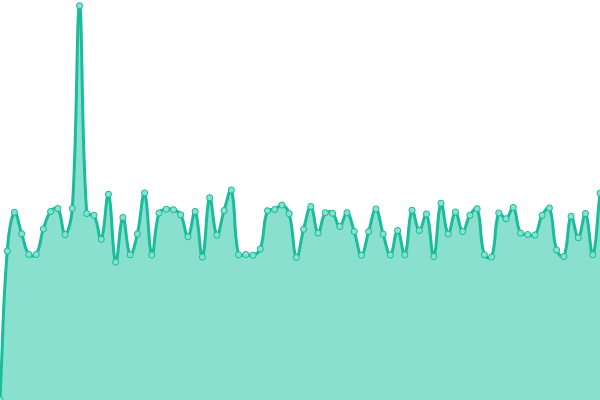

# [📈 Live Status](https://m-akbarfauzi.github.io/test-upptime): <!--live status--> **🟧 Partial outage**

This repository contains the open-source uptime monitor and status page for [Muhammad Akbar Fauzi](https://m-akbarfauzi.github.io/test-upptime), powered by [Upptime](https://github.com/upptime/upptime).

With [Upptime](https://upptime.js.org), you can get your own unlimited and free uptime monitor and status page, powered entirely by a GitHub repository. We use [Issues](https://github.com/m-akbarfauzi/test-upptime/issues) as incident reports, [Actions](https://github.com/m-akbarfauzi/test-upptime/actions) as uptime monitors, and [Pages](https://m-akbarfauzi.github.io/test-upptime) for the status page.

<!--start: status pages-->
<!-- This summary is generated by Upptime (https://github.com/upptime/upptime) -->
<!-- Do not edit this manually, your changes will be overwritten -->
<!-- prettier-ignore -->
| URL | Status | History | Response Time | Uptime |
| --- | ------ | ------- | ------------- | ------ |
|  [Tasikmalaya Kota](https://tasikmalayakota.go.id) | 🟩 Up | [tasikmalaya-kota.yml](https://github.com/m-akbarfauzi/uptime/commits/HEAD/history/tasikmalaya-kota.yml) | 

 1110ms
     
 | 

<a href="https://check.tasikmalayakota.go.id/history/tasikmalaya-kota">56.67%</a>
    

|  [Portal](https://portal.tasikmalayakota.go.id) | 🟩 Up | [portal.yml](https://github.com/m-akbarfauzi/uptime/commits/HEAD/history/portal.yml) | 

 1700ms
     
 | 

<a href="https://check.tasikmalayakota.go.id/history/portal">54.99%</a>
    

|  [Email](http://email.tasikmalayakota.go.id) | 🟩 Up | [email.yml](https://github.com/m-akbarfauzi/uptime/commits/HEAD/history/email.yml) | 

 2171ms
     
 | 

<a href="https://check.tasikmalayakota.go.id/history/email">56.45%</a>
    

|  [Suresman](https://suresman.tasikmalayakota.go.id) | 🟩 Up | [suresman.yml](https://github.com/m-akbarfauzi/uptime/commits/HEAD/history/suresman.yml) | 

 1230ms
     
 | 

<a href="https://check.tasikmalayakota.go.id/history/suresman">56.93%</a>
    

|  [Sipentas v.2 (Perizinan Online)](http://new.sipentas.tasikmalayakota.go.id) | 🟩 Up | [sipentas-v-2-perizinan-online.yml](https://github.com/m-akbarfauzi/uptime/commits/HEAD/history/sipentas-v-2-perizinan-online.yml) | 

 1349ms
     
 | 

<a href="https://check.tasikmalayakota.go.id/history/sipentas-v-2-perizinan-online">57.62%</a>
    

|  [Dinas Komunikasi dan Informatika](https://diskominfo.tasikmalayakota.go.id) | 🟩 Up | [dinas-komunikasi-dan-informatika.yml](https://github.com/m-akbarfauzi/uptime/commits/HEAD/history/dinas-komunikasi-dan-informatika.yml) | 

 4227ms
     
 | 

<a href="https://check.tasikmalayakota.go.id/history/dinas-komunikasi-dan-informatika">58.04%</a>
    

|  [Beta](https://beta.tasikmalayakota.go.id) | 🟩 Up | [beta.yml](https://github.com/m-akbarfauzi/uptime/commits/HEAD/history/beta.yml) | 

 1577ms
     
 | 

<a href="https://check.tasikmalayakota.go.id/history/beta">58.50%</a>
    

|  [Andimas](http://andimas.tasikmalayakota.go.id) | 🟩 Up | [andimas.yml](https://github.com/m-akbarfauzi/uptime/commits/HEAD/history/andimas.yml) | 

 1212ms
     
 | 

<a href="https://check.tasikmalayakota.go.id/history/andimas">59.27%</a>
    

|  [Arsip Dinamis](http://arsipdinamis.tasikmalayakota.go.id) | 🟩 Up | [arsip-dinamis.yml](https://github.com/m-akbarfauzi/uptime/commits/HEAD/history/arsip-dinamis.yml) | 

 922ms
     
 | 

<a href="https://check.tasikmalayakota.go.id/history/arsip-dinamis">60.01%</a>
    

|  [ATCS](http://atcs.tasikmalayakota.go.id) | 🟩 Up | [atcs.yml](https://github.com/m-akbarfauzi/uptime/commits/HEAD/history/atcs.yml) | 

 2123ms
     
 | 

<a href="https://check.tasikmalayakota.go.id/history/atcs">61.44%</a>
    

|  [Ayo Belajar](http://ayobelajar.tasikmalayakota.go.id) | 🟩 Up | [ayo-belajar.yml](https://github.com/m-akbarfauzi/uptime/commits/HEAD/history/ayo-belajar.yml) | 

 2483ms
     
 | 

<a href="https://check.tasikmalayakota.go.id/history/ayo-belajar">62.04%</a>
    

|  [Bappelitbangda](http://bappelitbangda.tasikmalayakota.go.id) | 🟩 Up | [bappelitbangda.yml](https://github.com/m-akbarfauzi/uptime/commits/HEAD/history/bappelitbangda.yml) | 

 5320ms
     
 | 

<a href="https://check.tasikmalayakota.go.id/history/bappelitbangda">62.34%</a>
    

|  [Bisma](http://bisma.tasikmalayakota.go.id) | 🟩 Up | [bisma.yml](https://github.com/m-akbarfauzi/uptime/commits/HEAD/history/bisma.yml) | 

 3131ms
     
 | 

<a href="https://check.tasikmalayakota.go.id/history/bisma">99.06%</a>
    

|  [BKPSDM](http://bkppd.tasikmalayakota.go.id) | 🟩 Up | [bkpsdm.yml](https://github.com/m-akbarfauzi/uptime/commits/HEAD/history/bkpsdm.yml) | 

 1496ms
     
 | 

<a href="https://check.tasikmalayakota.go.id/history/bkpsdm">63.09%</a>
    

|  [BPBD](http://bpbd.tasikmalayakota.go.id) | 🟩 Up | [bpbd.yml](https://github.com/m-akbarfauzi/uptime/commits/HEAD/history/bpbd.yml) | 

 2932ms
     
 | 

<a href="https://check.tasikmalayakota.go.id/history/bpbd">63.67%</a>
    

|  [BPKAD](http://bpkad.tasikmalayakota.go.id) | 🟩 Up | [bpkad.yml](https://github.com/m-akbarfauzi/uptime/commits/HEAD/history/bpkad.yml) | 

 1092ms
     
 | 

<a href="https://check.tasikmalayakota.go.id/history/bpkad">64.59%</a>
    

|  [Bapenda](http://bpprd.tasikmalayakota.go.id) | 🟩 Up | [bapenda.yml](https://github.com/m-akbarfauzi/uptime/commits/HEAD/history/bapenda.yml) | 

 966ms
     
 | 

<a href="https://check.tasikmalayakota.go.id/history/bapenda">65.27%</a>
    

|  [Command Center](https://cc.tasikmalayakota.go.id/login) | 🟥 Down | [command-center.yml](https://github.com/m-akbarfauzi/uptime/commits/HEAD/history/command-center.yml) | 

 0ms
     
 | 

<a href="https://check.tasikmalayakota.go.id/history/command-center">100.00%</a>
    

|  [CSR](http://csr.tasikmalayakota.go.id) | 🟩 Up | [csr.yml](https://github.com/m-akbarfauzi/uptime/commits/HEAD/history/csr.yml) | 

 1647ms
     
 | 

<a href="https://check.tasikmalayakota.go.id/history/csr">65.87%</a>
    

|  [Dekranasda](http://dekranasda.tasikmalayakota.go.id) | 🟩 Up | [dekranasda.yml](https://github.com/m-akbarfauzi/uptime/commits/HEAD/history/dekranasda.yml) | 

 984ms
     
 | 

<a href="https://check.tasikmalayakota.go.id/history/dekranasda">66.52%</a>
    

|  [Disdukcapil](http://dinasdukcapil.tasikmalayakota.go.id) | 🟩 Up | [disdukcapil.yml](https://github.com/m-akbarfauzi/uptime/commits/HEAD/history/disdukcapil.yml) | 

 2614ms
     
 | 

<a href="https://check.tasikmalayakota.go.id/history/disdukcapil">67.28%</a>
    

|  [Dinas Kesehatan](http://dinkes.tasikmalayakota.go.id) | 🟥 Down | [dinas-kesehatan.yml](https://github.com/m-akbarfauzi/uptime/commits/HEAD/history/dinas-kesehatan.yml) | 

 1096ms
     
 | 

<a href="https://check.tasikmalayakota.go.id/history/dinas-kesehatan">43.82%</a>
    

|  [Dipusipda](http://dipusipda.tasikmalayakota.go.id) | 🟩 Up | [dipusipda.yml](https://github.com/m-akbarfauzi/uptime/commits/HEAD/history/dipusipda.yml) | 

 2211ms
     
 | 

<a href="https://check.tasikmalayakota.go.id/history/dipusipda">67.55%</a>
    

|  [Dinas Pendidikan](http://disdik.tasikmalayakota.go.id) | 🟩 Up | [dinas-pendidikan.yml](https://github.com/m-akbarfauzi/uptime/commits/HEAD/history/dinas-pendidikan.yml) | 

 1815ms
     
 | 

<a href="https://check.tasikmalayakota.go.id/history/dinas-pendidikan">68.04%</a>
    

|  [Dinas Perhubungan](http://dishub.tasikmalayakota.go.id) | 🟩 Up | [dinas-perhubungan.yml](https://github.com/m-akbarfauzi/uptime/commits/HEAD/history/dinas-perhubungan.yml) | 

 2223ms
     
 | 

<a href="https://check.tasikmalayakota.go.id/history/dinas-perhubungan">68.51%</a>
    

|  [Dinas Tenaga Kerja](http://disnaker.tasikmalayakota.go.id) | 🟩 Up | [dinas-tenaga-kerja.yml](https://github.com/m-akbarfauzi/uptime/commits/HEAD/history/dinas-tenaga-kerja.yml) | 

 1026ms
     
 | 

<a href="https://check.tasikmalayakota.go.id/history/dinas-tenaga-kerja">69.01%</a>
    

|  [Disperawaskim](http://disperawaskim.tasikmalayakota.go.id) | 🟩 Up | [disperawaskim.yml](https://github.com/m-akbarfauzi/uptime/commits/HEAD/history/disperawaskim.yml) | 

 1429ms
     
 | 

<a href="https://check.tasikmalayakota.go.id/history/disperawaskim">69.32%</a>
    

|  [Disporabudpar](http://disporabudpar.tasikmalayakota.go.id) | 🟩 Up | [disporabudpar.yml](https://github.com/m-akbarfauzi/uptime/commits/HEAD/history/disporabudpar.yml) | 

 5058ms
     
 | 

<a href="https://check.tasikmalayakota.go.id/history/disporabudpar">69.74%</a>
    

|  [Aplikasi Manajemen Surat](http://disposisi.tasikmalayakota.go.id) | 🟩 Up | [aplikasi-manajemen-surat.yml](https://github.com/m-akbarfauzi/uptime/commits/HEAD/history/aplikasi-manajemen-surat.yml) | 

 857ms
     
 | 

<a href="https://check.tasikmalayakota.go.id/history/aplikasi-manajemen-surat">70.66%</a>
    

|  [DPMPTSP](http://dpmptsp.tasikmalayakota.go.id) | 🟩 Up | [dpmptsp.yml](https://github.com/m-akbarfauzi/uptime/commits/HEAD/history/dpmptsp.yml) | 

 743ms
     
 | 

<a href="https://check.tasikmalayakota.go.id/history/dpmptsp">71.10%</a>
    

|  [E-Kinerja](http://ekinerja.tasikmalayakota.go.id) | 🟩 Up | [e-kinerja.yml](https://github.com/m-akbarfauzi/uptime/commits/HEAD/history/e-kinerja.yml) | 

 1777ms
     
 | 

<a href="https://check.tasikmalayakota.go.id/history/e-kinerja">71.53%</a>
    

<!--end: status pages-->

[**Visit our status website →**](https://m-akbarfauzi.github.io/test-upptime)

## 📄 License

- Powered by: [Upptime](https://github.com/upptime/upptime)
- Code: [MIT](./LICENSE) © [Muhammad Akbar Fauzi](https://m-akbarfauzi.github.io/test-upptime)
- Data in the `./history` directory: [Open Database License](https://opendatacommons.org/licenses/odbl/1-0/)
