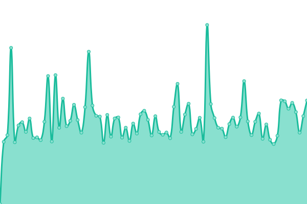

# [📈 Live Status](https://m-akbarfauzi.github.io/test-upptime): <!--live status--> **🟧 Partial outage**

This repository contains the open-source uptime monitor and status page for [Muhammad Akbar Fauzi](https://m-akbarfauzi.github.io/test-upptime), powered by [Upptime](https://github.com/upptime/upptime).

With [Upptime](https://upptime.js.org), you can get your own unlimited and free uptime monitor and status page, powered entirely by a GitHub repository. We use [Issues](https://github.com/m-akbarfauzi/test-upptime/issues) as incident reports, [Actions](https://github.com/m-akbarfauzi/test-upptime/actions) as uptime monitors, and [Pages](https://m-akbarfauzi.github.io/test-upptime) for the status page.

<!--start: status pages-->
<!-- This summary is generated by Upptime (https://github.com/upptime/upptime) -->
<!-- Do not edit this manually, your changes will be overwritten -->
<!-- prettier-ignore -->
| URL | Status | History | Response Time | Uptime |
| --- | ------ | ------- | ------------- | ------ |
|  [Tasikmalaya Kota](https://tasikmalayakota.go.id) | 🟥 Down | [tasikmalaya-kota.yml](https://github.com/m-akbarfauzi/uptime/commits/HEAD/history/tasikmalaya-kota.yml) | 

 1111ms
     
 | 

<a href="https://check.tasikmalayakota.go.id/history/tasikmalaya-kota">58.16%</a>
    

|  [Portal](https://portal.tasikmalayakota.go.id) | 🟥 Down | [portal.yml](https://github.com/m-akbarfauzi/uptime/commits/HEAD/history/portal.yml) | 

 1716ms
     
 | 

<a href="https://check.tasikmalayakota.go.id/history/portal">57.50%</a>
    

|  [Email](http://email.tasikmalayakota.go.id) | 🟥 Down | [email.yml](https://github.com/m-akbarfauzi/uptime/commits/HEAD/history/email.yml) | 

 2167ms
     
 | 

<a href="https://check.tasikmalayakota.go.id/history/email">58.77%</a>
    

|  [Suresman](https://suresman.tasikmalayakota.go.id) | 🟥 Down | [suresman.yml](https://github.com/m-akbarfauzi/uptime/commits/HEAD/history/suresman.yml) | 

 1227ms
     
 | 

<a href="https://check.tasikmalayakota.go.id/history/suresman">59.12%</a>
    

|  [Sipentas v.2 (Perizinan Online)](http://new.sipentas.tasikmalayakota.go.id) | 🟥 Down | [sipentas-v-2-perizinan-online.yml](https://github.com/m-akbarfauzi/uptime/commits/HEAD/history/sipentas-v-2-perizinan-online.yml) | 

 1343ms
     
 | 

<a href="https://check.tasikmalayakota.go.id/history/sipentas-v-2-perizinan-online">59.34%</a>
    

|  [Dinas Komunikasi dan Informatika](https://diskominfo.tasikmalayakota.go.id) | 🟥 Down | [dinas-komunikasi-dan-informatika.yml](https://github.com/m-akbarfauzi/uptime/commits/HEAD/history/dinas-komunikasi-dan-informatika.yml) | 

 4190ms
     
 | 

<a href="https://check.tasikmalayakota.go.id/history/dinas-komunikasi-dan-informatika">59.78%</a>
    

|  [Beta](https://beta.tasikmalayakota.go.id) | 🟥 Down | [beta.yml](https://github.com/m-akbarfauzi/uptime/commits/HEAD/history/beta.yml) | 

 1571ms
     
 | 

<a href="https://check.tasikmalayakota.go.id/history/beta">60.25%</a>
    

|  [Andimas](http://andimas.tasikmalayakota.go.id) | 🟥 Down | [andimas.yml](https://github.com/m-akbarfauzi/uptime/commits/HEAD/history/andimas.yml) | 

 1212ms
     
 | 

<a href="https://check.tasikmalayakota.go.id/history/andimas">61.03%</a>
    

|  [Arsip Dinamis](http://arsipdinamis.tasikmalayakota.go.id) | 🟥 Down | [arsip-dinamis.yml](https://github.com/m-akbarfauzi/uptime/commits/HEAD/history/arsip-dinamis.yml) | 

 921ms
     
 | 

<a href="https://check.tasikmalayakota.go.id/history/arsip-dinamis">61.77%</a>
    

|  [ATCS](http://atcs.tasikmalayakota.go.id) | 🟥 Down | [atcs.yml](https://github.com/m-akbarfauzi/uptime/commits/HEAD/history/atcs.yml) | 

 2119ms
     
 | 

<a href="https://check.tasikmalayakota.go.id/history/atcs">63.44%</a>
    

|  [Ayo Belajar](http://ayobelajar.tasikmalayakota.go.id) | 🟥 Down | [ayo-belajar.yml](https://github.com/m-akbarfauzi/uptime/commits/HEAD/history/ayo-belajar.yml) | 

 2516ms
     
 | 

<a href="https://check.tasikmalayakota.go.id/history/ayo-belajar">63.98%</a>
    

|  [Bappelitbangda](http://bappelitbangda.tasikmalayakota.go.id) | 🟥 Down | [bappelitbangda.yml](https://github.com/m-akbarfauzi/uptime/commits/HEAD/history/bappelitbangda.yml) | 

 5421ms
     
 | 

<a href="https://check.tasikmalayakota.go.id/history/bappelitbangda">64.34%</a>
    

|  [Bisma](http://bisma.tasikmalayakota.go.id) | 🟩 Up | [bisma.yml](https://github.com/m-akbarfauzi/uptime/commits/HEAD/history/bisma.yml) | 

 3131ms
     
 | 

<a href="https://check.tasikmalayakota.go.id/history/bisma">99.06%</a>
    

|  [BKPSDM](http://bkppd.tasikmalayakota.go.id) | 🟥 Down | [bkpsdm.yml](https://github.com/m-akbarfauzi/uptime/commits/HEAD/history/bkpsdm.yml) | 

 1486ms
     
 | 

<a href="https://check.tasikmalayakota.go.id/history/bkpsdm">65.04%</a>
    

|  [BPBD](http://bpbd.tasikmalayakota.go.id) | 🟥 Down | [bpbd.yml](https://github.com/m-akbarfauzi/uptime/commits/HEAD/history/bpbd.yml) | 

 2925ms
     
 | 

<a href="https://check.tasikmalayakota.go.id/history/bpbd">65.65%</a>
    

|  [BPKAD](http://bpkad.tasikmalayakota.go.id) | 🟥 Down | [bpkad.yml](https://github.com/m-akbarfauzi/uptime/commits/HEAD/history/bpkad.yml) | 

 1090ms
     
 | 

<a href="https://check.tasikmalayakota.go.id/history/bpkad">66.39%</a>
    

|  [Bapenda](http://bpprd.tasikmalayakota.go.id) | 🟥 Down | [bapenda.yml](https://github.com/m-akbarfauzi/uptime/commits/HEAD/history/bapenda.yml) | 

 966ms
     
 | 

<a href="https://check.tasikmalayakota.go.id/history/bapenda">67.08%</a>
    

|  [Command Center](https://cc.tasikmalayakota.go.id/login) | 🟥 Down | [command-center.yml](https://github.com/m-akbarfauzi/uptime/commits/HEAD/history/command-center.yml) | 

 0ms
     
 | 

<a href="https://check.tasikmalayakota.go.id/history/command-center">100.00%</a>
    

|  [CSR](http://csr.tasikmalayakota.go.id) | 🟥 Down | [csr.yml](https://github.com/m-akbarfauzi/uptime/commits/HEAD/history/csr.yml) | 

 1644ms
     
 | 

<a href="https://check.tasikmalayakota.go.id/history/csr">67.69%</a>
    

|  [Dekranasda](http://dekranasda.tasikmalayakota.go.id) | 🟥 Down | [dekranasda.yml](https://github.com/m-akbarfauzi/uptime/commits/HEAD/history/dekranasda.yml) | 

 984ms
     
 | 

<a href="https://check.tasikmalayakota.go.id/history/dekranasda">68.34%</a>
    

|  [Disdukcapil](http://dinasdukcapil.tasikmalayakota.go.id) | 🟥 Down | [disdukcapil.yml](https://github.com/m-akbarfauzi/uptime/commits/HEAD/history/disdukcapil.yml) | 

 2539ms
     
 | 

<a href="https://check.tasikmalayakota.go.id/history/disdukcapil">69.11%</a>
    

|  [Dinas Kesehatan](http://dinkes.tasikmalayakota.go.id) | 🟥 Down | [dinas-kesehatan.yml](https://github.com/m-akbarfauzi/uptime/commits/HEAD/history/dinas-kesehatan.yml) | 

 1105ms
     
 | 

<a href="https://check.tasikmalayakota.go.id/history/dinas-kesehatan">47.45%</a>
    

|  [Dipusipda](http://dipusipda.tasikmalayakota.go.id) | 🟥 Down | [dipusipda.yml](https://github.com/m-akbarfauzi/uptime/commits/HEAD/history/dipusipda.yml) | 

 2213ms
     
 | 

<a href="https://check.tasikmalayakota.go.id/history/dipusipda">69.41%</a>
    

|  [Dinas Pendidikan](http://disdik.tasikmalayakota.go.id) | 🟥 Down | [dinas-pendidikan.yml](https://github.com/m-akbarfauzi/uptime/commits/HEAD/history/dinas-pendidikan.yml) | 

 1812ms
     
 | 

<a href="https://check.tasikmalayakota.go.id/history/dinas-pendidikan">69.91%</a>
    

|  [Dinas Perhubungan](http://dishub.tasikmalayakota.go.id) | 🟥 Down | [dinas-perhubungan.yml](https://github.com/m-akbarfauzi/uptime/commits/HEAD/history/dinas-perhubungan.yml) | 

 2223ms
     
 | 

<a href="https://check.tasikmalayakota.go.id/history/dinas-perhubungan">70.53%</a>
    

|  [Dinas Tenaga Kerja](http://disnaker.tasikmalayakota.go.id) | 🟥 Down | [dinas-tenaga-kerja.yml](https://github.com/m-akbarfauzi/uptime/commits/HEAD/history/dinas-tenaga-kerja.yml) | 

 1026ms
     
 | 

<a href="https://check.tasikmalayakota.go.id/history/dinas-tenaga-kerja">71.00%</a>
    

|  [Disperawaskim](http://disperawaskim.tasikmalayakota.go.id) | 🟥 Down | [disperawaskim.yml](https://github.com/m-akbarfauzi/uptime/commits/HEAD/history/disperawaskim.yml) | 

 1420ms
     
 | 

<a href="https://check.tasikmalayakota.go.id/history/disperawaskim">71.32%</a>
    

|  [Disporabudpar](http://disporabudpar.tasikmalayakota.go.id) | 🟥 Down | [disporabudpar.yml](https://github.com/m-akbarfauzi/uptime/commits/HEAD/history/disporabudpar.yml) | 

 4978ms
     
 | 

<a href="https://check.tasikmalayakota.go.id/history/disporabudpar">71.75%</a>
    

|  [Aplikasi Manajemen Surat](http://disposisi.tasikmalayakota.go.id) | 🟥 Down | [aplikasi-manajemen-surat.yml](https://github.com/m-akbarfauzi/uptime/commits/HEAD/history/aplikasi-manajemen-surat.yml) | 

 856ms
     
 | 

<a href="https://check.tasikmalayakota.go.id/history/aplikasi-manajemen-surat">72.65%</a>
    

|  [DPMPTSP](http://dpmptsp.tasikmalayakota.go.id) | 🟥 Down | [dpmptsp.yml](https://github.com/m-akbarfauzi/uptime/commits/HEAD/history/dpmptsp.yml) | 

 742ms
     
 | 

<a href="https://check.tasikmalayakota.go.id/history/dpmptsp">73.11%</a>
    

|  [E-Kinerja](http://ekinerja.tasikmalayakota.go.id) | 🟥 Down | [e-kinerja.yml](https://github.com/m-akbarfauzi/uptime/commits/HEAD/history/e-kinerja.yml) | 

 1776ms
     
 | 

<a href="https://check.tasikmalayakota.go.id/history/e-kinerja">73.53%</a>
    

<!--end: status pages-->

[**Visit our status website →**](https://m-akbarfauzi.github.io/test-upptime)

## 📄 License

- Powered by: [Upptime](https://github.com/upptime/upptime)
- Code: [MIT](./LICENSE) © [Muhammad Akbar Fauzi](https://m-akbarfauzi.github.io/test-upptime)
- Data in the `./history` directory: [Open Database License](https://opendatacommons.org/licenses/odbl/1-0/)
