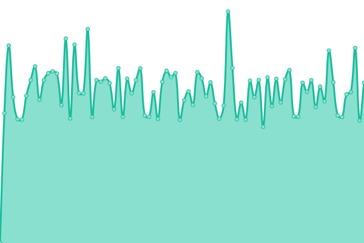

# [📈 Live Status](https://m-akbarfauzi.github.io/test-upptime): <!--live status--> **🟧 Partial outage**

This repository contains the open-source uptime monitor and status page for [Muhammad Akbar Fauzi](https://m-akbarfauzi.github.io/test-upptime), powered by [Upptime](https://github.com/upptime/upptime).

With [Upptime](https://upptime.js.org), you can get your own unlimited and free uptime monitor and status page, powered entirely by a GitHub repository. We use [Issues](https://github.com/m-akbarfauzi/test-upptime/issues) as incident reports, [Actions](https://github.com/m-akbarfauzi/test-upptime/actions) as uptime monitors, and [Pages](https://m-akbarfauzi.github.io/test-upptime) for the status page.

<!--start: status pages-->
<!-- This summary is generated by Upptime (https://github.com/upptime/upptime) -->
<!-- Do not edit this manually, your changes will be overwritten -->
<!-- prettier-ignore -->
| URL | Status | History | Response Time | Uptime |
| --- | ------ | ------- | ------------- | ------ |
|  [Tasikmalaya Kota](https://tasikmalayakota.go.id) | 🟩 Up | [tasikmalaya-kota.yml](https://github.com/m-akbarfauzi/uptime/commits/HEAD/history/tasikmalaya-kota.yml) | 

 996ms
     
 | 

<a href="https://check.tasikmalayakota.go.id/history/tasikmalaya-kota">51.18%</a>
    

|  [Portal](https://portal.tasikmalayakota.go.id) | 🟩 Up | [portal.yml](https://github.com/m-akbarfauzi/uptime/commits/HEAD/history/portal.yml) | 

 1518ms
     
 | 

<a href="https://check.tasikmalayakota.go.id/history/portal">66.64%</a>
    

|  [Email](http://email.tasikmalayakota.go.id) | 🟩 Up | [email.yml](https://github.com/m-akbarfauzi/uptime/commits/HEAD/history/email.yml) | 

 1523ms
     
 | 

<a href="https://check.tasikmalayakota.go.id/history/email">25.89%</a>
    

|  [Suresman](https://suresman.tasikmalayakota.go.id) | 🟩 Up | [suresman.yml](https://github.com/m-akbarfauzi/uptime/commits/HEAD/history/suresman.yml) | 

 1105ms
     
 | 

<a href="https://check.tasikmalayakota.go.id/history/suresman">32.01%</a>
    

|  [Diskominfo](https://diskominfo.tasikmalayakota.go.id) | 🟩 Up | [diskominfo.yml](https://github.com/m-akbarfauzi/uptime/commits/HEAD/history/diskominfo.yml) | 

 4494ms
     
 | 

<a href="https://check.tasikmalayakota.go.id/history/diskominfo">67.19%</a>
    

|  [SmartKelurahan](https://beta.tasikmalayakota.go.id) | 🟩 Up | [smart-kelurahan.yml](https://github.com/m-akbarfauzi/uptime/commits/HEAD/history/smart-kelurahan.yml) | 

 1319ms
     
 | 

<a href="https://check.tasikmalayakota.go.id/history/smart-kelurahan">8.14%</a>
    

|  [Andimas](http://andimas.tasikmalayakota.go.id) | 🟩 Up | [andimas.yml](https://github.com/m-akbarfauzi/uptime/commits/HEAD/history/andimas.yml) | 

 887ms
     
 | 

<a href="https://check.tasikmalayakota.go.id/history/andimas">29.08%</a>
    

|  [Arsip Dinamis](http://arsipdinamis.tasikmalayakota.go.id) | 🟩 Up | [arsip-dinamis.yml](https://github.com/m-akbarfauzi/uptime/commits/HEAD/history/arsip-dinamis.yml) | 

 659ms
     
 | 

<a href="https://check.tasikmalayakota.go.id/history/arsip-dinamis">29.94%</a>
    

|  [ATCS](http://atcs.tasikmalayakota.go.id) | 🟩 Up | [atcs.yml](https://github.com/m-akbarfauzi/uptime/commits/HEAD/history/atcs.yml) | 

 1689ms
     
 | 

<a href="https://check.tasikmalayakota.go.id/history/atcs">30.76%</a>
    

|  [Ayo Belajar](http://ayobelajar.tasikmalayakota.go.id) | 🟩 Up | [ayo-belajar.yml](https://github.com/m-akbarfauzi/uptime/commits/HEAD/history/ayo-belajar.yml) | 

 1795ms
     
 | 

<a href="https://check.tasikmalayakota.go.id/history/ayo-belajar">31.56%</a>
    

|  [Website Profile Bappelitbangda](http://bappelitbangda.tasikmalayakota.go.id) | 🟩 Up | [website-profile-bappelitbangda.yml](https://github.com/m-akbarfauzi/uptime/commits/HEAD/history/website-profile-bappelitbangda.yml) | 

 5185ms
     
 | 

<a href="https://check.tasikmalayakota.go.id/history/website-profile-bappelitbangda">32.23%</a>
    

|  [Bisma](http://bisma.tasikmalayakota.go.id) | 🟩 Up | [bisma.yml](https://github.com/m-akbarfauzi/uptime/commits/HEAD/history/bisma.yml) | 

 953ms
     
 | 

<a href="https://check.tasikmalayakota.go.id/history/bisma">100.00%</a>
    

|  [Website Profile BKPSDM](http://bkppd.tasikmalayakota.go.id) | 🟩 Up | [website-profile-bkpsdm.yml](https://github.com/m-akbarfauzi/uptime/commits/HEAD/history/website-profile-bkpsdm.yml) | 

 1082ms
     
 | 

<a href="https://check.tasikmalayakota.go.id/history/website-profile-bkpsdm">33.00%</a>
    

|  [Website Profile BPBD](http://bpbd.tasikmalayakota.go.id) | 🟩 Up | [website-profile-bpbd.yml](https://github.com/m-akbarfauzi/uptime/commits/HEAD/history/website-profile-bpbd.yml) | 

 2852ms
     
 | 

<a href="https://check.tasikmalayakota.go.id/history/website-profile-bpbd">33.83%</a>
    

|  [Website Profile BPKAD](http://bpkad.tasikmalayakota.go.id) | 🟩 Up | [website-profile-bpkad.yml](https://github.com/m-akbarfauzi/uptime/commits/HEAD/history/website-profile-bpkad.yml) | 

 1113ms
     
 | 

<a href="https://check.tasikmalayakota.go.id/history/website-profile-bpkad">34.63%</a>
    

|  [Website Profile Bapenda](http://bpprd.tasikmalayakota.go.id) | 🟩 Up | [website-profile-bapenda.yml](https://github.com/m-akbarfauzi/uptime/commits/HEAD/history/website-profile-bapenda.yml) | 

 844ms
     
 | 

<a href="https://check.tasikmalayakota.go.id/history/website-profile-bapenda">35.46%</a>
    

|  [Command Center](http://cc.tasikmalayakota.go.id) | 🟥 Down | [command-center.yml](https://github.com/m-akbarfauzi/uptime/commits/HEAD/history/command-center.yml) | 

 0ms
     
 | 

<a href="https://check.tasikmalayakota.go.id/history/command-center">0.04%</a>
    

|  [CSR](http://csr.tasikmalayakota.go.id) | 🟩 Up | [csr.yml](https://github.com/m-akbarfauzi/uptime/commits/HEAD/history/csr.yml) | 

 1378ms
     
 | 

<a href="https://check.tasikmalayakota.go.id/history/csr">38.77%</a>
    

|  [Dekranasda](http://dekranasda.tasikmalayakota.go.id) | 🟩 Up | [dekranasda.yml](https://github.com/m-akbarfauzi/uptime/commits/HEAD/history/dekranasda.yml) | 

 785ms
     
 | 

<a href="https://check.tasikmalayakota.go.id/history/dekranasda">39.75%</a>
    

|  [Website Profile Disdukcapil](http://dinasdukcapil.tasikmalayakota.go.id) | 🟩 Up | [website-profile-disdukcapil.yml](https://github.com/m-akbarfauzi/uptime/commits/HEAD/history/website-profile-disdukcapil.yml) | 

 2522ms
     
 | 

<a href="https://check.tasikmalayakota.go.id/history/website-profile-disdukcapil">15.91%</a>
    

|  [Website Profile Dinas Kesehatan](http://dinkes.tasikmalayakota.go.id) | 🟩 Up | [website-profile-dinas-kesehatan.yml](https://github.com/m-akbarfauzi/uptime/commits/HEAD/history/website-profile-dinas-kesehatan.yml) | 

 942ms
     
 | 

<a href="https://check.tasikmalayakota.go.id/history/website-profile-dinas-kesehatan">7.67%</a>
    

|  [Website Profile Dipusipda](http://dipusipda.tasikmalayakota.go.id) | 🟩 Up | [website-profile-dipusipda.yml](https://github.com/m-akbarfauzi/uptime/commits/HEAD/history/website-profile-dipusipda.yml) | 

 1611ms
     
 | 

<a href="https://check.tasikmalayakota.go.id/history/website-profile-dipusipda">17.83%</a>
    

|  [Website Profile Dinas Pendidikan](http://disdik.tasikmalayakota.go.id) | 🟩 Up | [website-profile-dinas-pendidikan.yml](https://github.com/m-akbarfauzi/uptime/commits/HEAD/history/website-profile-dinas-pendidikan.yml) | 

 1311ms
     
 | 

<a href="https://check.tasikmalayakota.go.id/history/website-profile-dinas-pendidikan">18.79%</a>
    

|  [Website Profile Dinas Perhubungan](http://dishub.tasikmalayakota.go.id) | 🟩 Up | [website-profile-dinas-perhubungan.yml](https://github.com/m-akbarfauzi/uptime/commits/HEAD/history/website-profile-dinas-perhubungan.yml) | 

 1552ms
     
 | 

<a href="https://check.tasikmalayakota.go.id/history/website-profile-dinas-perhubungan">19.75%</a>
    

|  [Website Profile Dinas Tenaga Kerja](http://disnaker.tasikmalayakota.go.id) | 🟩 Up | [website-profile-dinas-tenaga-kerja.yml](https://github.com/m-akbarfauzi/uptime/commits/HEAD/history/website-profile-dinas-tenaga-kerja.yml) | 

 854ms
     
 | 

<a href="https://check.tasikmalayakota.go.id/history/website-profile-dinas-tenaga-kerja">20.70%</a>
    

|  [Website Profile Disperawaskim](http://disperawaskim.tasikmalayakota.go.id) | 🟩 Up | [website-profile-disperawaskim.yml](https://github.com/m-akbarfauzi/uptime/commits/HEAD/history/website-profile-disperawaskim.yml) | 

 1147ms
     
 | 

<a href="https://check.tasikmalayakota.go.id/history/website-profile-disperawaskim">21.68%</a>
    

|  [Website Profile Disporabudpar](http://disporabudpar.tasikmalayakota.go.id) | 🟩 Up | [website-profile-disporabudpar.yml](https://github.com/m-akbarfauzi/uptime/commits/HEAD/history/website-profile-disporabudpar.yml) | 

 3716ms
     
 | 

<a href="https://check.tasikmalayakota.go.id/history/website-profile-disporabudpar">22.55%</a>
    

|  [Aplikasi Manajemen Surat](http://disposisi.tasikmalayakota.go.id) | 🟩 Up | [aplikasi-manajemen-surat.yml](https://github.com/m-akbarfauzi/uptime/commits/HEAD/history/aplikasi-manajemen-surat.yml) | 

 599ms
     
 | 

<a href="https://check.tasikmalayakota.go.id/history/aplikasi-manajemen-surat">23.53%</a>
    

|  [Website Profile DPMPTSP](http://dpmptsp.tasikmalayakota.go.id) | 🟩 Up | [website-profile-dpmptsp.yml](https://github.com/m-akbarfauzi/uptime/commits/HEAD/history/website-profile-dpmptsp.yml) | 

 603ms
     
 | 

<a href="https://check.tasikmalayakota.go.id/history/website-profile-dpmptsp">24.50%</a>
    

|  [E-Kinerja](http://ekinerja.tasikmalayakota.go.id) | 🟩 Up | [e-kinerja.yml](https://github.com/m-akbarfauzi/uptime/commits/HEAD/history/e-kinerja.yml) | 

 651ms
     
 | 

<a href="https://check.tasikmalayakota.go.id/history/e-kinerja">25.51%</a>
    

<!--end: status pages-->

[**Visit our status website →**](https://m-akbarfauzi.github.io/test-upptime)

## 📄 License

- Powered by: [Upptime](https://github.com/upptime/upptime)
- Code: [MIT](./LICENSE) © [Muhammad Akbar Fauzi](https://m-akbarfauzi.github.io/test-upptime)
- Data in the `./history` directory: [Open Database License](https://opendatacommons.org/licenses/odbl/1-0/)
