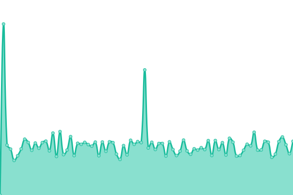
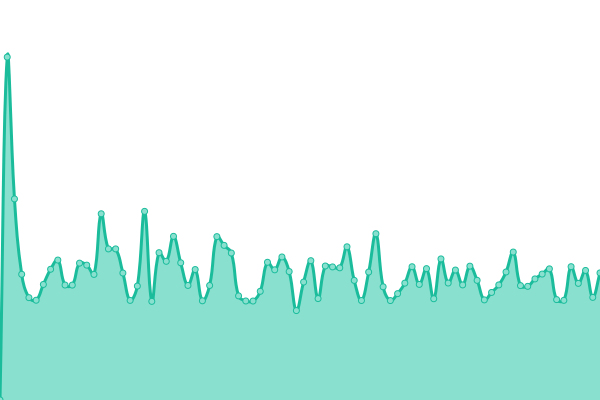

# [📈 Live Status](https://m-akbarfauzi.github.io/test-upptime): <!--live status--> **🟧 Partial outage**

This repository contains the open-source uptime monitor and status page for [Muhammad Akbar Fauzi](https://m-akbarfauzi.github.io/test-upptime), powered by [Upptime](https://github.com/upptime/upptime).

With [Upptime](https://upptime.js.org), you can get your own unlimited and free uptime monitor and status page, powered entirely by a GitHub repository. We use [Issues](https://github.com/m-akbarfauzi/test-upptime/issues) as incident reports, [Actions](https://github.com/m-akbarfauzi/test-upptime/actions) as uptime monitors, and [Pages](https://m-akbarfauzi.github.io/test-upptime) for the status page.

<!--start: status pages-->
<!-- This summary is generated by Upptime (https://github.com/upptime/upptime) -->
<!-- Do not edit this manually, your changes will be overwritten -->
<!-- prettier-ignore -->
| URL | Status | History | Response Time | Uptime |
| --- | ------ | ------- | ------------- | ------ |
|  [Tasikmalaya Kota](https://tasikmalayakota.go.id) | 🟩 Up | [tasikmalaya-kota.yml](https://github.com/m-akbarfauzi/uptime/commits/HEAD/history/tasikmalaya-kota.yml) | 

 990ms
     
 | 

<a href="https://check.tasikmalayakota.go.id/history/tasikmalaya-kota">52.53%</a>
    

|  [Portal](https://portal.tasikmalayakota.go.id) | 🟥 Down | [portal.yml](https://github.com/m-akbarfauzi/uptime/commits/HEAD/history/portal.yml) | 

 1585ms
     
 | 

<a href="https://check.tasikmalayakota.go.id/history/portal">69.64%</a>
    

|  [Email](http://email.tasikmalayakota.go.id) | 🟥 Down | [email.yml](https://github.com/m-akbarfauzi/uptime/commits/HEAD/history/email.yml) | 

 1431ms
     
 | 

<a href="https://check.tasikmalayakota.go.id/history/email">12.93%</a>
    

|  [Suresman](https://suresman.tasikmalayakota.go.id) | 🟥 Down | [suresman.yml](https://github.com/m-akbarfauzi/uptime/commits/HEAD/history/suresman.yml) | 

 1172ms
     
 | 

<a href="https://check.tasikmalayakota.go.id/history/suresman">25.40%</a>
    

|  [Diskominfo](https://diskominfo.tasikmalayakota.go.id) | 🟥 Down | [diskominfo.yml](https://github.com/m-akbarfauzi/uptime/commits/HEAD/history/diskominfo.yml) | 

 4476ms
     
 | 

<a href="https://check.tasikmalayakota.go.id/history/diskominfo">69.96%</a>
    

|  [SmartKelurahan](https://beta.tasikmalayakota.go.id) | 🟥 Down | [smart-kelurahan.yml](https://github.com/m-akbarfauzi/uptime/commits/HEAD/history/smart-kelurahan.yml) | 

 1328ms
     
 | 

<a href="https://check.tasikmalayakota.go.id/history/smart-kelurahan">3.65%</a>
    

|  [Andimas](http://andimas.tasikmalayakota.go.id) | 🟥 Down | [andimas.yml](https://github.com/m-akbarfauzi/uptime/commits/HEAD/history/andimas.yml) | 

 952ms
     
 | 

<a href="https://check.tasikmalayakota.go.id/history/andimas">18.85%</a>
    

|  [Arsip Dinamis](http://arsipdinamis.tasikmalayakota.go.id) | 🟥 Down | [arsip-dinamis.yml](https://github.com/m-akbarfauzi/uptime/commits/HEAD/history/arsip-dinamis.yml) | 

 684ms
     
 | 

<a href="https://check.tasikmalayakota.go.id/history/arsip-dinamis">19.62%</a>
    

|  [ATCS](http://atcs.tasikmalayakota.go.id) | 🟥 Down | [atcs.yml](https://github.com/m-akbarfauzi/uptime/commits/HEAD/history/atcs.yml) | 

 1717ms
     
 | 

<a href="https://check.tasikmalayakota.go.id/history/atcs">20.36%</a>
    

|  [Ayo Belajar](http://ayobelajar.tasikmalayakota.go.id) | 🟥 Down | [ayo-belajar.yml](https://github.com/m-akbarfauzi/uptime/commits/HEAD/history/ayo-belajar.yml) | 

 1808ms
     
 | 

<a href="https://check.tasikmalayakota.go.id/history/ayo-belajar">21.06%</a>
    

|  [Website Profile Bappelitbangda](http://bappelitbangda.tasikmalayakota.go.id) | 🟥 Down | [website-profile-bappelitbangda.yml](https://github.com/m-akbarfauzi/uptime/commits/HEAD/history/website-profile-bappelitbangda.yml) | 

 4384ms
     
 | 

<a href="https://check.tasikmalayakota.go.id/history/website-profile-bappelitbangda">21.80%</a>
    

|  [Bisma](http://bisma.tasikmalayakota.go.id) | 🟩 Up | [bisma.yml](https://github.com/m-akbarfauzi/uptime/commits/HEAD/history/bisma.yml) | 

 910ms
     
 | 

<a href="https://check.tasikmalayakota.go.id/history/bisma">100.00%</a>
    

|  [Website Profile BKPSDM](http://bkppd.tasikmalayakota.go.id) | 🟥 Down | [website-profile-bkpsdm.yml](https://github.com/m-akbarfauzi/uptime/commits/HEAD/history/website-profile-bkpsdm.yml) | 

 1041ms
     
 | 

<a href="https://check.tasikmalayakota.go.id/history/website-profile-bkpsdm">22.46%</a>
    

|  [Website Profile BPBD](http://bpbd.tasikmalayakota.go.id) | 🟥 Down | [website-profile-bpbd.yml](https://github.com/m-akbarfauzi/uptime/commits/HEAD/history/website-profile-bpbd.yml) | 

 3331ms
     
 | 

<a href="https://check.tasikmalayakota.go.id/history/website-profile-bpbd">23.20%</a>
    

|  [Website Profile BPKAD](http://bpkad.tasikmalayakota.go.id) | 🟥 Down | [website-profile-bpkad.yml](https://github.com/m-akbarfauzi/uptime/commits/HEAD/history/website-profile-bpkad.yml) | 

 1402ms
     
 | 

<a href="https://check.tasikmalayakota.go.id/history/website-profile-bpkad">23.89%</a>
    

|  [Website Profile Bapenda](http://bpprd.tasikmalayakota.go.id) | 🟥 Down | [website-profile-bapenda.yml](https://github.com/m-akbarfauzi/uptime/commits/HEAD/history/website-profile-bapenda.yml) | 

 897ms
     
 | 

<a href="https://check.tasikmalayakota.go.id/history/website-profile-bapenda">24.61%</a>
    

|  [Command Center](http://cc.tasikmalayakota.go.id) | 🟥 Down | [command-center.yml](https://github.com/m-akbarfauzi/uptime/commits/HEAD/history/command-center.yml) | 

 0ms
     
 | 

<a href="https://check.tasikmalayakota.go.id/history/command-center">0.09%</a>
    

|  [CSR](http://csr.tasikmalayakota.go.id) | 🟥 Down | [csr.yml](https://github.com/m-akbarfauzi/uptime/commits/HEAD/history/csr.yml) | 

 1158ms
     
 | 

<a href="https://check.tasikmalayakota.go.id/history/csr">25.75%</a>
    

|  [Dekranasda](http://dekranasda.tasikmalayakota.go.id) | 🟥 Down | [dekranasda.yml](https://github.com/m-akbarfauzi/uptime/commits/HEAD/history/dekranasda.yml) | 

 769ms
     
 | 

<a href="https://check.tasikmalayakota.go.id/history/dekranasda">26.70%</a>
    

|  [Website Profile Disdukcapil](http://dinasdukcapil.tasikmalayakota.go.id) | 🟥 Down | [website-profile-disdukcapil.yml](https://github.com/m-akbarfauzi/uptime/commits/HEAD/history/website-profile-disdukcapil.yml) | 

 2468ms
     
 | 

<a href="https://check.tasikmalayakota.go.id/history/website-profile-disdukcapil">27.68%</a>
    

|  [Website Profile](http://dinkes.tasikmalayakota.go.id) | 🟥 Down | [website-profile.yml](https://github.com/m-akbarfauzi/uptime/commits/HEAD/history/website-profile.yml) | 

 845ms
     
 | 

<a href="https://check.tasikmalayakota.go.id/history/website-profile">28.64%</a>
    

|  [Website Profile Dipusipda](http://dipusipda.tasikmalayakota.go.id) | 🟥 Down | [website-profile-dipusipda.yml](https://github.com/m-akbarfauzi/uptime/commits/HEAD/history/website-profile-dipusipda.yml) | 

 1544ms
     
 | 

<a href="https://check.tasikmalayakota.go.id/history/website-profile-dipusipda">29.65%</a>
    

|  [Website Profile Dinas Pendidikan](http://disdik.tasikmalayakota.go.id) | 🟥 Down | [website-profile-dinas-pendidikan.yml](https://github.com/m-akbarfauzi/uptime/commits/HEAD/history/website-profile-dinas-pendidikan.yml) | 

 1195ms
     
 | 

<a href="https://check.tasikmalayakota.go.id/history/website-profile-dinas-pendidikan">30.60%</a>
    

|  [Website Profile Dinas Perhubungan](http://dishub.tasikmalayakota.go.id) | 🟥 Down | [website-profile-dinas-perhubungan.yml](https://github.com/m-akbarfauzi/uptime/commits/HEAD/history/website-profile-dinas-perhubungan.yml) | 

 1443ms
     
 | 

<a href="https://check.tasikmalayakota.go.id/history/website-profile-dinas-perhubungan">31.59%</a>
    

|  [Website Profile Dinas Tenaga Kerja](http://disnaker.tasikmalayakota.go.id) | 🟥 Down | [website-profile-dinas-tenaga-kerja.yml](https://github.com/m-akbarfauzi/uptime/commits/HEAD/history/website-profile-dinas-tenaga-kerja.yml) | 

 759ms
     
 | 

<a href="https://check.tasikmalayakota.go.id/history/website-profile-dinas-tenaga-kerja">32.57%</a>
    

|  [Website Profile Disperawaskim](http://disperawaskim.tasikmalayakota.go.id) | 🟥 Down | [website-profile-disperawaskim.yml](https://github.com/m-akbarfauzi/uptime/commits/HEAD/history/website-profile-disperawaskim.yml) | 

 1066ms
     
 | 

<a href="https://check.tasikmalayakota.go.id/history/website-profile-disperawaskim">33.53%</a>
    

|  [Website Profile Disporabudpar](http://disporabudpar.tasikmalayakota.go.id) | 🟥 Down | [website-profile-disporabudpar.yml](https://github.com/m-akbarfauzi/uptime/commits/HEAD/history/website-profile-disporabudpar.yml) | 

 2499ms
     
 | 

<a href="https://check.tasikmalayakota.go.id/history/website-profile-disporabudpar">34.52%</a>
    

|  [Aplikasi Manajemen Surat](http://disposisi.tasikmalayakota.go.id) | 🟥 Down | [aplikasi-manajemen-surat.yml](https://github.com/m-akbarfauzi/uptime/commits/HEAD/history/aplikasi-manajemen-surat.yml) | 

 575ms
     
 | 

<a href="https://check.tasikmalayakota.go.id/history/aplikasi-manajemen-surat">35.49%</a>
    

|  [Website Profile DPMPTSP](http://dpmptsp.tasikmalayakota.go.id) | 🟥 Down | [website-profile-dpmptsp.yml](https://github.com/m-akbarfauzi/uptime/commits/HEAD/history/website-profile-dpmptsp.yml) | 

 582ms
     
 | 

<a href="https://check.tasikmalayakota.go.id/history/website-profile-dpmptsp">36.50%</a>
    

|  [E-Kinerja](http://ekinerja.tasikmalayakota.go.id) | 🟥 Down | [e-kinerja.yml](https://github.com/m-akbarfauzi/uptime/commits/HEAD/history/e-kinerja.yml) | 

 612ms
     
 | 

<a href="https://check.tasikmalayakota.go.id/history/e-kinerja">37.48%</a>
    

<!--end: status pages-->

[**Visit our status website →**](https://m-akbarfauzi.github.io/test-upptime)

## 📄 License

- Powered by: [Upptime](https://github.com/upptime/upptime)
- Code: [MIT](./LICENSE) © [Muhammad Akbar Fauzi](https://m-akbarfauzi.github.io/test-upptime)
- Data in the `./history` directory: [Open Database License](https://opendatacommons.org/licenses/odbl/1-0/)
